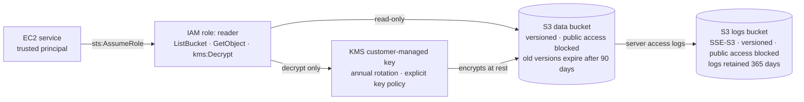

# aws-secure-iac-pipeline

[](https://github.com/AlistairCrowley/aws-secure-iac-pipeline/actions/workflows/security.yml)

Terraform-built AWS infrastructure with a GitHub Actions pipeline that blocks insecure changes before they deploy.

This project builds a small, deliberately hardened AWS environment entirely as code, then puts security scanning in front of it so that insecure changes are caught before they ever reach AWS. The goal is to show the full loop: write infrastructure, scan it, make and document risk decisions, and eventually enforce those checks automatically in CI/CD.

**Status:** In progress. Phases 0–3 complete; Phase 4 underway. The security pipeline scans every pull request and every push to `main`, and a branch ruleset blocks any merge into `main` unless every required check passes. The pipeline has been hardened against pull requests that suppress their own findings; next is a deliberately insecure pull request to prove the gate holds. Nothing is deployed to AWS yet, and everything so far runs at no cost.

---

## Architecture (current)



---

## What's built so far

**S3 data bucket**
- All four public access block settings enabled, so the bucket can't be made public by ACL or bucket policy
- Encrypted at rest with a customer-managed KMS key, with an S3 bucket key to reduce KMS request costs
- Versioning enabled, so overwritten or deleted files can be recovered
- Lifecycle rule: old versions expire after 90 days, and incomplete multipart uploads are cleaned up after 7 days
**KMS key**
- Customer-managed key with automatic annual rotation
- Explicit key policy written in code (account delegates access to IAM, following AWS's default pattern), instead of relying on an invisible default
- 7-day deletion window
**IAM role (least privilege)**
- Trust policy: only the EC2 service can assume the role
- Permissions: list and read objects in the one data bucket, and decrypt with the one data key. No write, no delete, no access to anything else.
**Access logging**
- Dedicated logs bucket receiving S3 server access logs from the data bucket
- Logs bucket has its own public access block, encryption (SSE-S3, since log delivery doesn't support customer-managed keys), versioning, and a 365-day retention rule
- Bucket policy allows only the S3 logging service to write, only for the data bucket, only in this account
---

## Security pipeline

Every pull request and every push to `main` runs four scanners in parallel through GitHub Actions ([`.github/workflows/security.yml`](.github/workflows/security.yml)). Any finding fails the run.

A branch ruleset on `main` turns a failed run into a blocked merge: changes reach `main` only through a pull request, all five checks must pass, force-pushes and branch deletion are blocked, and there is no bypass, including for the repository owner.

The fifth check, the **suppression guard**, closes the obvious loophole. Every scanner can be silenced by an inline skip comment, so a pull request could quietly suppress its own findings and pass. The guard fails any pull request that adds a new suppression unless the same pull request also updates [docs/security-decisions.md](docs/security-decisions.md). A suppression ships with a written decision, or it doesn't ship.

| Job | Tool | What it catches |
|---|---|---|
| Secrets | [Gitleaks](https://github.com/gitleaks/gitleaks) | Keys, tokens, and passwords anywhere in the full git history, including secrets committed and later deleted |
| SAST | [Semgrep](https://semgrep.dev/) (`p/terraform`, `p/github-actions`) | Insecure patterns in the Terraform and in the pipeline itself, such as unpinned actions or shell injection |
| SCA + IaC | [Trivy](https://trivy.dev/) | Terraform misconfigurations, with severity ratings; dependency vulnerabilities (see note) |
| IaC | [Checkov](https://www.checkov.io/) | Terraform misconfigurations against AWS security best practices |

Running two IaC scanners is deliberate: they overlap, but each catches things the other misses. Where both flag the same issue, that finding carries more weight.

**Note on dependency scanning:** the repo has no package manifests yet, so Trivy's vulnerability scanner currently has nothing to cover. Its report shows "not scanned," not "clean." It activates automatically when a manifest is added.

### Hardening the pipeline itself

A security pipeline is itself an attack path, so it gets the same treatment as the infrastructure:

- **Code pinned, detection kept fresh.** Every action is pinned to a full commit SHA, every container image to a digest, and every runner to a fixed Ubuntu release (`ubuntu-24.04`). Version tags can be silently repointed; SHAs and digests can't. This is the failure mode behind the March 2026 Trivy supply-chain compromise ([CVE-2026-33634](https://github.com/aquasecurity/trivy/security/advisories/GHSA-69fq-xp46-6x23)), in which 76 of 77 `trivy-action` version tags were force-pushed to malicious code; the advisory itself notes that images referenced by digest were unaffected. Detection rules are deliberately not frozen: Semgrep pulls its registry rules, and Trivy its vulnerability database and checks bundle, on every run, so new detections apply immediately. Checkov's rules ship inside its pinned image.
- **No credentials left on disk.** Every checkout sets `persist-credentials: false`, so the workflow token is never written into the job's git configuration where later steps could read it.
- **No wrapper action for Trivy.** Trivy runs from its official container image, which keeps one more third-party action out of the chain.
- **Read-only token.** The workflow's `GITHUB_TOKEN` is limited to `contents: read`. Only the Gitleaks job adds `pull-requests: read`, to list a PR's commits. PR comments are turned off rather than granting write access.
- **Failures actually fail.** Semgrep and Trivy report findings but exit successfully by default, which would produce a green check with problems in it. They run with `--error` and `--exit-code 1` so the exit code carries the verdict. Checkov fails on findings by default.
- **No phoning home.** Semgrep runs with metrics off, and Checkov with `--skip-download`.
- **Bounded runs.** Every job has a 10-minute timeout instead of GitHub's 6-hour default, and a new push to a pull request cancels that pull request's older run. Runs on `main` are never cancelled, so every merge gets a full scan.
- **No script injection.** Values from the pull request event reach shell steps only through environment variables, never pasted directly into the script.
- **The pipeline checked itself before its first run.** Semgrep's GitHub Actions rules, run against the draft workflow, flagged four mutable action tags. Pinning cleared all four before the first commit.
### Infrastructure controls verified by the scanners

- S3 public access blocked (ACLs and policies)
- Encryption with a customer-managed KMS key
- KMS key rotation enabled
- KMS key policy explicitly defined
- Versioning enabled
- Lifecycle configuration present
- Access logging enabled
- IAM policies grant no unrestricted S3 access
Current result: every Checkov and Trivy finding is either fixed or suppressed inline with a documented reason. Nothing is left unaddressed.

---

## Security decisions

Not every scanner finding should be fixed. Each one was weighed on risk, cost, and effort, and the decision recorded. Full reasoning, compensating controls, and "revisit if" conditions are in [docs/security-decisions.md](docs/security-decisions.md).

| Finding | Decision | Reason |
|---|---|---|
| No lifecycle configuration | **Fixed** | Versioning keeps old copies forever; cleanup controls cost |
| No customer-managed KMS key (flagged HIGH) | **Fixed** | Flagged by both tools; gives control over key use and an audit trail |
| No access logging | **Fixed** | Audit trail needed for any investigation |
| Key policy flagged for `kms:*` and resource `*` | **Suppressed as false positive** | In a key policy, `*` means "this key only," and the account principal delegates to IAM. This is AWS's recommended pattern. Suppressed inline with a written reason. |
| Logs bucket not using a customer-managed KMS key | **Suppressed: not supported** | S3 server access logging can't deliver to a bucket encrypted with a customer-managed key; SSE-S3 is used instead |
| No cross-region replication | **Accepted** | A disaster-recovery control for business-critical data; this is demo data, and versioning already covers recovery |
| No event notifications | **Accepted** | No downstream system to notify; access logging covers the audit need |

Suppressions are applied narrowly, inline on the specific resource, with the reason recorded next to them. Checks stay active everywhere else.

---

## Repository layout

```
.
├── terraform/
│   ├── providers.tf    # Terraform and AWS provider versions, default tags
│   ├── variables.tf    # Region and project name
│   ├── main.tf         # S3 buckets, KMS key, IAM role, access logging
│   └── outputs.tf      # Bucket name/ARN, role ARN
├── docs/
│   └── security-decisions.md   # Risk decisions and scanner suppressions
└── .github/workflows/
    └── security.yml    # Security pipeline: four scanners plus a suppression guard, all pinned
```

---

## Running it locally

Requires Terraform 1.10+, Python (for Checkov), and Trivy. No AWS account is needed for these steps. The same checks, plus Gitleaks and Semgrep, run automatically in CI; the workflow file has the exact flags.

```bash
cd terraform
terraform init
terraform fmt -check
terraform validate
cd ..
checkov -d terraform --compact --quiet
trivy config terraform
```

---

## Roadmap

- [x] **Phase 0:** Tooling
- [x] **Phase 1:** Terraform written and validated locally
- [x] **Phase 2:** Local security scanning, triage, and documented risk decisions
- [x] **Phase 3:** GitHub Actions pipeline
  - [x] Secrets (Gitleaks), SAST (Semgrep), SCA + IaC (Trivy), and IaC (Checkov) on every PR and push to `main`, all pinned
  - [x] Branch ruleset: merges to `main` blocked unless every check passes
  - [ ] Optional: scan results uploaded to the GitHub Security tab (SARIF)
- [ ] **Phase 4:** Prove it works (in progress)
  - [x] Pipeline hardening: suppression guard, no persisted credentials, job timeouts, pinned runner
  - [ ] A deliberately insecure pull request, blocked by the scanners
  - [ ] The same change with a skip comment added, blocked by the suppression guard
- [ ] **Phase 5:** Deploy to AWS using GitHub OIDC (no stored access keys), with manual approval before apply
- [ ] **Phase 6:** Continuous compliance: nightly scans, drift detection, CIS AWS Foundations mapping
- [ ] **Phase 7:** Final documentation
---
