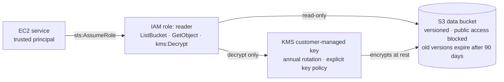

# aws-secure-iac-pipeline

Terraform-built AWS infrastructure with a GitHub Actions pipeline that blocks insecure changes before they deploy.

This project builds a small, deliberately hardened AWS environment entirely as code, then puts security scanning in front of it so that insecure changes are caught before they ever reach AWS. The goal is to show the full loop: write infrastructure, scan it, make and document risk decisions, and eventually enforce those checks automatically in CI/CD.

**Status:** In progress. Phase 2 of 7 (local security scanning). Nothing is deployed to AWS yet; all work so far runs locally at no cost.

---

## Architecture (current)



---

## What's built so far

**S3 data bucket**
- All four public access block settings enabled, so the bucket can't be made public by ACL or bucket policy
- Encrypted at rest with a customer-managed KMS key, with an S3 bucket key to reduce KMS request costs
- Versioning enabled, so overwritten or deleted files can be recovered
- Lifecycle rule: old versions expire after 90 days, and incomplete multipart uploads are cleaned up after 7 days

**KMS key**
- Customer-managed key with automatic annual rotation
- Explicit key policy written in code (account delegates access to IAM, following AWS's default pattern), instead of relying on an invisible default
- 7-day deletion window

**IAM role (least privilege)**
- Trust policy: only the EC2 service can assume the role
- Permissions: list and read objects in the one data bucket, and decrypt with the one data key. No write, no delete, no access to anything else.

**Access logging** *(in progress)*
- Dedicated logs bucket receiving S3 server access logs from the data bucket, with a bucket policy scoped to the S3 logging service, the data bucket, and this account only

---

## Security scanning

The Terraform is scanned locally with two independent tools:

| Tool | What it checks |
|---|---|
| [Checkov](https://www.checkov.io/) | Terraform misconfigurations against AWS security best practices |
| [Trivy](https://trivy.dev/) | Terraform misconfigurations (with severity ratings) |

Running two scanners is deliberate: they overlap, but each catches things the other misses. Where both flag the same issue, that finding carries more weight.

### Controls verified by the scanners

- S3 public access blocked (ACLs and policies)
- Encryption with a customer-managed KMS key
- KMS key rotation enabled
- KMS key policy explicitly defined
- Versioning enabled
- Lifecycle configuration present
- IAM policies grant no unrestricted S3 access

---

## Security decisions

Not every scanner finding should be fixed. Each one was weighed on risk, cost, and effort, and the decision recorded.

| Finding | Decision | Reason |
|---|---|---|
| No lifecycle configuration | **Fixed** | Versioning keeps old copies forever; cleanup controls cost |
| No customer-managed KMS key (flagged HIGH) | **Fixed** | Flagged by both tools; gives control over key use and an audit trail |
| No access logging | **Fixing** | Audit trail needed for any investigation |
| Key policy flagged for `kms:*` and resource `*` | **Suppressed as false positive** | In a key policy, `*` means "this key only," and the account principal delegates to IAM. This is AWS's recommended pattern. Suppressed inline with a written reason. |
| No cross-region replication | **Accepted** | A disaster-recovery control for business-critical data; this is demo data, and versioning already covers recovery |
| No event notifications | **Accepted** | No downstream system to notify; access logging covers the audit need |

Suppressions are applied narrowly, inline on the specific resource, with the reason recorded next to them. Checks stay active everywhere else.

---

## Repository layout

```
.
├── terraform/
│   ├── providers.tf    # Terraform and AWS provider versions, default tags
│   ├── variables.tf    # Region and project name
│   ├── main.tf         # S3 bucket, KMS key, IAM role
│   └── outputs.tf      # Bucket name/ARN, role ARN
├── docs/
│   └── BUILD_PLAN.md   # Step-by-step plan, decisions log, lessons learned
└── .github/workflows/  # CI/CD pipeline (Phase 3)
```

---

## Running it locally

Requires Terraform 1.10+, Python (for Checkov), and Trivy. No AWS account is needed for these steps.

```bash
cd terraform
terraform init
terraform fmt -check
terraform validate
cd ..
checkov -d terraform --compact --quiet
trivy config terraform
```

---

## Roadmap

- [x] **Phase 0:** Tooling
- [x] **Phase 1:** Terraform written and validated locally
- [ ] **Phase 2:** Local security scanning and triage *(in progress)*
- [ ] **Phase 3:** GitHub Actions pipeline: secrets (Gitleaks), SAST (Semgrep), dependency scanning (Trivy), IaC scanning (Checkov); merges blocked on failure
- [ ] **Phase 4:** Prove it works: a deliberately insecure pull request, blocked by the pipeline
- [ ] **Phase 5:** Deploy to AWS using GitHub OIDC (no stored access keys), with manual approval before apply
- [ ] **Phase 6:** Continuous compliance: nightly scans, drift detection, CIS AWS Foundations mapping
- [ ] **Phase 7:** Final documentation

---
